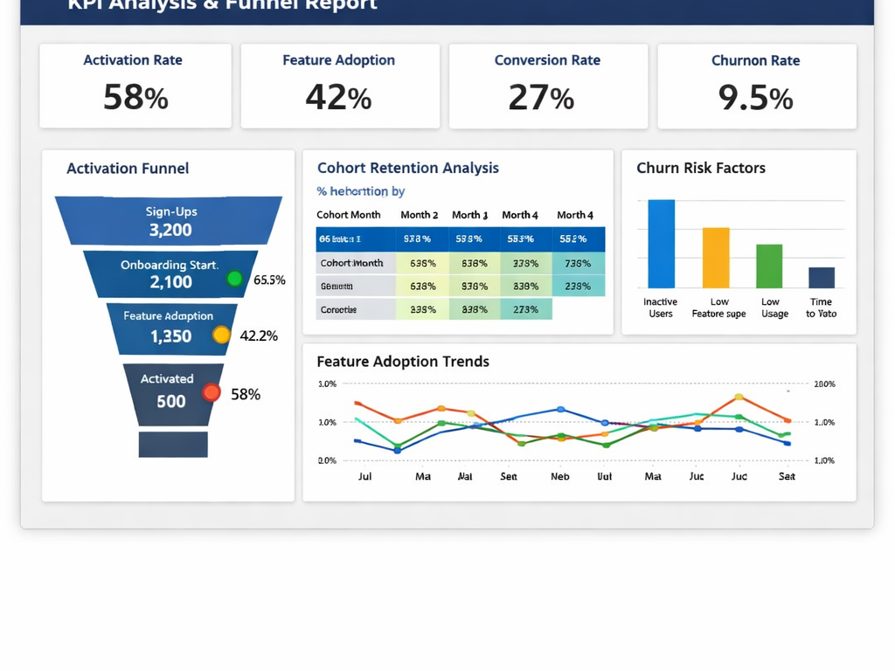

# 📊 Product & Performance Analytics – SaaS CRM

🚀 End-to-end analytics solution using Python, SQL, and Power BI  
📈 Focus: Activation, Adoption, and Churn Reduction  
🧠 Includes KPI design, data modelling, and stakeholder insights  

Developed an end-to-end product and performance analytics solution for a B2B SaaS CRM, enabling KPI tracking, user behaviour analysis, and data-driven decision-making to improve activation, engagement, and reduce churn.

🔗 This repository includes full data pipelines, SQL models, and Power BI dashboards used to generate insights.

---

# 🎯 Business Problem

The company faces challenges with:

- Low and inconsistent user activation

- Weak feature adoption across customers

- Early-stage churn due to slow time-to-value

- Misaligned reporting across teams

This project aims to create clarity by defining consistent KPIs and providing reliable performance insights.

---

## 📈 Key Metrics (KPIs)

- **Activation Rate** – % of users performing key actions within 14 days

- **Feature Adoption Rate** – % of users engaging with core features

- **Deal Conversion Rate** – % of deals closed successfully

- **User Engagement Trends**

- **Churn Risk Indicators**

---

## 💼 Business Impact

- Identified key drop-off points in onboarding impacting activation rates  
- Highlighted low feature adoption as a driver of early churn  
- Provided insights to improve user engagement and product usage  
- Enabled data-driven decision-making across product and sales teams

---

## 🛠️ Tech Stack

- **Python** – Data cleaning, transformation

- **SQL (DuckDB)** – Data extraction, transformation, and analytical modelling  

- **Power BI** – Dashboarding and visualisation

- **VS Code** – Development environment

---

## 🧱 Data Architecture

The project follows a layered data model:

  - **Raw Layer** – Source event and account data

  - **Bronze Layer** – Cleaned and standardised data

  - **Silver Layer** – Modelled datasets for analysis

This structure ensures scalability, consistency, and data quality.

---

## 🔄 Data Workflow

1. Data Collection – Raw product and account data  
2. Data Cleaning – Python (Pandas)  
3. Data Modelling – SQL (Bronze → Silver layers)  
4. Analysis – KPI definition and trend analysis  
5. Visualisation – Power BI dashboards

---
## 📊 Dashboard Preview

### Overview Dashboard

### KPI Analysis

---

## 🔍 Key Analysis Performed

- Cohort analysis (user activation over time)  
- Funnel analysis (onboarding drop-offs)  
- Feature adoption tracking  
- Trend analysis of user engagement  
- Root-cause investigation of churn risk  

---

## 🔍 Key Insights

  - Users failing to adopt core features early are more likely to churn

  - Activation is a critical driver of long-term engagement

  - Certain onboarding stages show significant drop-offs

  - High engagement correlates with improved conversion rates

---

## 🧠 Key Takeaways

- Activation is the strongest predictor of retention  
- Early feature adoption reduces churn risk  
- Data-driven onboarding improvements can significantly increase engagement  

## 💡 Recommendations

- Improve onboarding flow to increase early activation

- Promote key features earlier in the user journey

- Introduce guided workflows for new users

- Align KPI definitions across teams for consistent reporting

---

## 📂 Repository Structure

📂 data – Raw and processed datasets  
📂 notebooks – Exploratory analysis (Python)  
📂 sql – Data transformations and modelling  
📂 powerbi – Dashboard files and reports  

---

# 👤 Author

## Hi, I'm Elack 👋

Data Analyst specialising in performance analytics, KPI reporting, and Power BI dashboards.

🔍 Focus: Data-driven decision-making  
📊 Tools: SQL, Python, Power BI  
⚡ Experience: Energy & operational analytics  

📌 Featured Project:
- Product & Performance Analytics (SaaS CRM)

---

## ⭐ Project Value

This project demonstrates:

- End-to-end analytics workflow

- Performance and product analytics expertise

- KPI design aligned to business goals

- Data storytelling for decision-making
README.md
